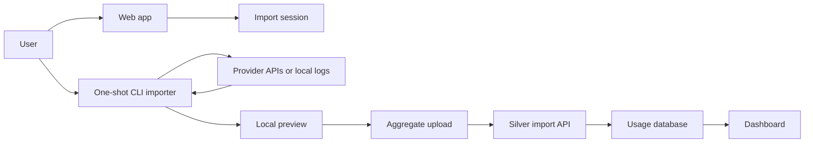
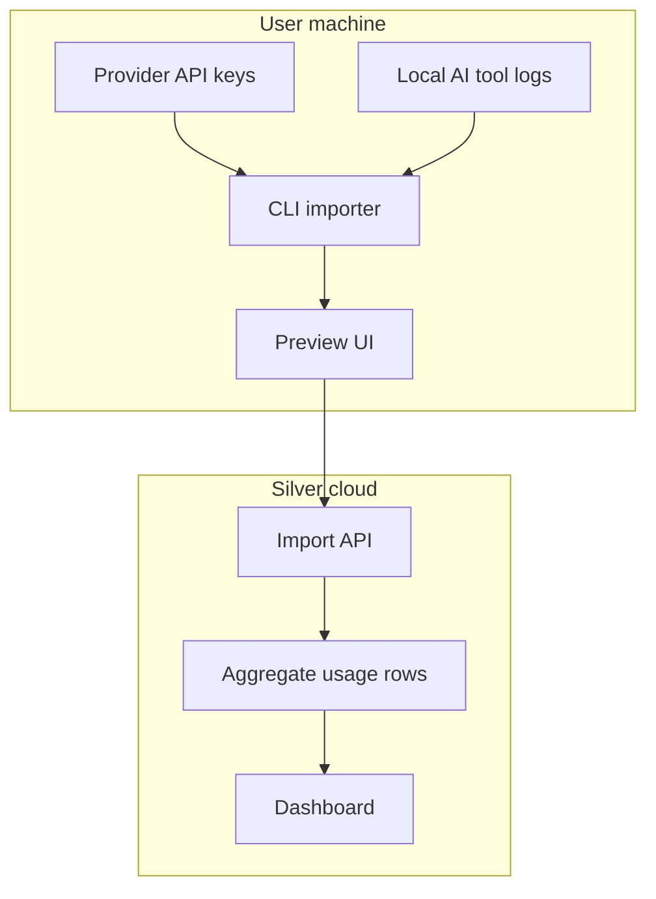

# Architecture

## High-Level Shape

Silver Token Ledger has two ingestion paths:

- Browser/provider import for providers with usable usage APIs.
- Local one-shot CLI import for local logs, provider keys in environment variables, and future MCP workflows.



## Components

### Web App

Responsibilities:

- Create import sessions.
- Display provider setup instructions.
- Accept normalized import payloads.
- Render dashboards.
- Let users delete imported data.

### Import Session API

Responsibilities:

- Create short-lived import tokens.
- Bind uploads to a user or anonymous session.
- Reject expired or replayed uploads.
- Store only normalized aggregates.

Suggested endpoints:

```text
POST /api/token-ledger/import-sessions
GET  /api/token-ledger/import-sessions/:id
POST /api/token-ledger/import-sessions/:id/upload
POST /api/token-ledger/import-sessions/:id/confirm
DELETE /api/token-ledger/import-sessions/:id
```

### CLI Importer

Responsibilities:

- Detect supported local sources.
- Pull provider usage data when credentials exist locally.
- Normalize provider-specific fields.
- Show a local preview.
- Upload only aggregate usage.

Candidate package:

```bash
npx -y @silver/token-ledger import
```

### MCP Importer

The MCP version can expose the same import capabilities to coding agents:

```text
token_ledger.detect_sources
token_ledger.preview_import
token_ledger.upload_import
```

This should be added after the CLI path is stable. The MCP server should reuse the CLI core package instead of duplicating provider logic.

## Trust Boundary

Provider credentials should remain local whenever possible.

For provider APIs that support browser-safe OAuth or scoped tokens, the web app can connect directly. For admin keys or API keys, the preferred flow is local CLI import.



## Data Storage

Store normalized usage buckets, not raw provider responses.

Suggested tables:

```text
import_sessions
- id
- user_id nullable
- status
- created_at
- expires_at
- confirmed_at nullable

usage_buckets
- id
- import_session_id
- provider
- source
- bucket_start
- bucket_end
- bucket_width
- model nullable
- project_id_hash nullable
- api_key_id_hash nullable
- request_count nullable
- input_tokens nullable
- output_tokens nullable
- cached_input_tokens nullable
- cache_creation_input_tokens nullable
- reasoning_tokens nullable
- audio_input_tokens nullable
- image_input_tokens nullable
- cost_usd nullable
- cost_source
- created_at

import_warnings
- id
- import_session_id
- provider
- code
- message
- created_at
```

Project IDs and API key IDs should be hashed by default. The user can opt into readable labels later.

## Cost Normalization

Cost source should be explicit:

- `provider_actual`: the provider returned exact request cost.
- `provider_report`: the provider returned billing/reporting cost.
- `estimated`: Silver calculated cost from model prices.
- `unknown`: cost is unavailable.

Do not mix estimated and actual costs silently in the same chart. The dashboard should label mixed data.

## Failure Modes

- Provider API lacks historical usage access.
- Admin key is required and user only has a normal API key.
- Billing data is delayed.
- Provider returns tokens but not cost.
- Provider returns cost but not token categories.
- Local logs contain private prompt content.
- User imports duplicate ranges.

Each importer should return warnings that the UI can display.

