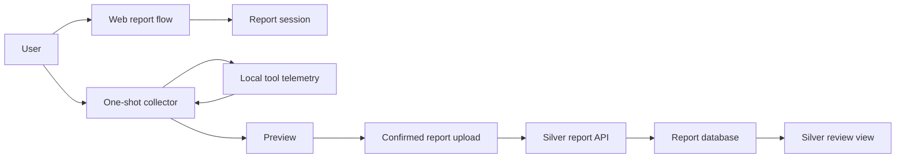
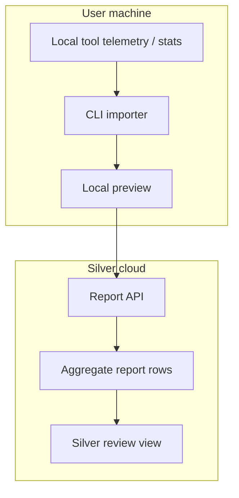

# Architecture

Implementation stack:

- Docker.
- Python.
- FastAPI.
- Jinja2.
- HTMX.
- Pydantic.
- SQLAlchemy/Alembic.
- PostgreSQL.
- Typer CLI.
- Python MCP server.

See [Technical architecture](technical-architecture.md) for the implementation-level layout.

## High-Level Shape

Silver Usage Report has one core job: turn heterogeneous AI usage sources into a normalized report that a user can safely submit to Silver.

The current candidate-facing system is collector-first:

- Web report session.
- Local one-shot collector for supported local telemetry.
- Live preview panel that updates when rows arrive.
- Future MCP workflow that wraps the same importer core.



## Components

### Web Report Flow

Responsibilities:

- Create report sessions.
- Explain what Silver needs and why.
- Display collector instructions.
- Accept normalized report payloads.
- Render the live report preview.
- Let users confirm or delete submitted reports.

### Report Session API

Responsibilities:

- Create short-lived report tokens.
- Bind uploads to an anonymous session or declared individual identity.
- Reject expired or replayed uploads.
- Store only normalized aggregate report rows.
- Preserve source and confidence labels.

Suggested endpoints:

```text
POST   /api/usage-report/sessions
GET    /api/usage-report/sessions/:id
POST   /api/usage-report/sessions/:id/upload
POST   /api/usage-report/sessions/:id/confirm
DELETE /api/usage-report/sessions/:id
GET    /api/usage-report/admin/reports
```

### CLI Importer

Responsibilities:

- Pair with a report session.
- Detect supported local sources.
- Pull provider usage data when credentials exist locally.
- Normalize provider-specific fields.
- Show a local preview.
- Upload only aggregate report rows after confirmation.

Candidate package:

```powershell
irm "https://open.silver.dev/reports/sessions/SESSION_ID/collector.ps1" | iex
```

### Manual, CSV, And JSON Import

Status: deferred. The current web flow does not expose manual, CSV, or JSON
fallbacks to candidates.

### MCP Importer

The MCP version can expose the same import capabilities to coding agents:

```text
usage_report.preview_report
usage_report.upload_report
usage_report.get_report_status
```

The MCP importer is central to the "paste this prompt in your local agent" flow. It should accept only strict structured rows, validate source/confidence/evidence, and reject sensitive fields.

See [MCP-assisted import](mcp-assisted-import.md).

## Trust Boundary

Provider credentials should remain local whenever possible.

For the current employee-focused MVP, do not ask users for provider admin keys or organization credentials. The preferred automatic flow is local inspection of tool telemetry/stats, followed by a preview and explicit confirmation.



## Data Storage

Store normalized report rows, not raw provider responses.

Suggested tables:

```text
report_sessions
- id
- user_id nullable
- reporter_label nullable
- status
- created_at
- expires_at
- confirmed_at nullable

usage_report_rows
- id
- report_session_id
- provider
- tool nullable
- source
- period_start
- period_end
- period_width
- model nullable
- request_count nullable
- input_tokens nullable
- output_tokens nullable
- cached_input_tokens nullable
- cache_creation_input_tokens nullable
- reasoning_tokens nullable
- total_tokens nullable
- cost_usd nullable
- cost_source
- confidence
- evidence_json nullable
- created_at

report_warnings
- id
- report_session_id
- provider nullable
- tool nullable
- code
- message
- created_at
```

Project IDs, API key IDs, team names, and machine names should be excluded by default. If the product later needs labels, they should be opt-in and clearly previewed.

## Cost Normalization

Cost source should be explicit:

- `provider_actual`: the provider returned exact request cost.
- `provider_report`: the provider returned billing/reporting cost.
- `estimated`: Silver calculated cost from model prices.
- `manual`: the user entered a cost number.
- `unknown`: cost is unavailable.

Do not mix estimated, manual, and actual costs silently. Silver's review UI should label mixed data.

## Confidence Model

Each report row should carry confidence:

- `high`: verified structured export or future official source. Out of current employee MVP for provider org APIs.
- `medium`: local tool log or gateway export that includes token fields.
- `low`: manual entry, screenshot/OCR, or inferred estimate.

Confidence is not a judgment of the user. It is a signal for how much Silver should rely on the row.

The server should derive or cap confidence from source and evidence. The client or LLM should not be able to mark an unsupported claim as high confidence.

See [Trust model](trust-model.md).

## Failure Modes

- Provider API lacks historical usage access.
- A provider/tool only exposes org/admin analytics, which employees cannot access.
- Billing data is delayed.
- Provider returns tokens but not cost.
- Provider returns cost but not token categories.
- Local logs contain private prompt content.
- User imports duplicate ranges.
- User uses a tool with no export or local stats.
- User enters rough manual estimates.
- A tool or provider only exposes organization/admin analytics that employees cannot access.

Each importer should return warnings that the UI can display.
