# Arquitectura

Silver Usage Report es una aplicacion Python para recolectar, previsualizar y enviar a Silver metricas agregadas de uso de herramientas de IA. El flujo actual es web-first y collector-first: la persona crea una sesion privada, ejecuta un collector PowerShell one-shot, revisa una previsualizacion local y solo despues confirma el envio.

Stack principal:

- FastAPI para API HTTP, paginas web y healthcheck.
- Jinja2 + HTMX para UI server-rendered.
- Pydantic para contratos de datos y validacion.
- SQLAlchemy para modelos y acceso a datos.
- Alembic para migraciones versionadas.
- PostgreSQL en Docker Compose.
- SQLite como default local liviano si `DATABASE_URL` no se configura.
- CLI Python con `argparse`.

Ver [Arquitectura tecnica](technical-architecture.md) para layout de codigo, rutas y runtime.

## Forma General

El sistema evita recolectar prompts, respuestas, codigo fuente, logs crudos o API keys. La unidad persistida es una fila agregada de uso por periodo/modelo, junto con warnings y evidencia tecnica sanitizada.

```mermaid
flowchart LR
  User["Persona"] --> Web["Web report flow"]
  Web --> Session["Sesion privada"]
  Session --> Collector["collector.ps1 con token"]
  Collector --> LocalTelemetry["Telemetria local soportada"]
  LocalTelemetry --> LocalPreview["Preview local"]
  LocalPreview --> SignedSubmit["API submit firmado"]
  SignedSubmit --> Db["Base de datos"]
  Db --> Admin["Panel admin Silver"]
```



## Componentes

### Web Report Flow

Responsabilidades:

- Crear sesiones privadas de reporte.
- Mostrar instrucciones y comando collector con token embebido.
- Abrir una sesion existente desde su management link.
- Renderizar la pagina privada de sesion, estado, reporte y detalle candidato.
- Redirigir automaticamente al detalle cuando llega el submit del collector.
- Permitir borrado de datos desde la sesion privada.
- Servir `collector.ps1` generado para una sesion.

Rutas web reales:

```text
GET  /
POST /reports/sessions
POST /reports/sessions/open
GET  /reports/sessions/{session_id}?token=PRIVATE_TOKEN
POST /reports/sessions/{session_id}/submit?token=PRIVATE_TOKEN
GET  /reports/sessions/{session_id}/report?token=PRIVATE_TOKEN
POST /reports/sessions/{session_id}/delete?token=PRIVATE_TOKEN
GET  /reports/sessions/{session_id}/status?token=PRIVATE_TOKEN
GET  /reports/sessions/{session_id}/preview-panel?token=PRIVATE_TOKEN
GET  /reports/sessions/{session_id}/report-redirect?token=PRIVATE_TOKEN
POST /reports/sessions/{session_id}/delete-managed
GET  /reports/sessions/{session_id}/collector.ps1?token=PRIVATE_TOKEN
```

### API De Reportes

La API soporta el collector y el CLI de desarrollo. La creacion de sesion devuelve un `private_token`; las operaciones privadas requieren `token=PRIVATE_TOKEN`.
Los POST privados que reciben datos tambien deben firmar el body con HMAC-SHA256
usando ese token y enviar `X-Silver-Timestamp` + `X-Silver-Signature`. El
timestamp tiene una ventana de 5 minutos.

La creacion de sesiones limita a 5 reportes por candidato cuando existen
identificadores comparables como `candidate_ref`, email, GitHub, X o nombre.

Rutas API reales:

```text
POST   /api/usage-report/sessions
GET    /api/usage-report/sessions/{session_id}?token=PRIVATE_TOKEN
GET    /api/usage-report/sessions/{session_id}/status?token=PRIVATE_TOKEN
POST   /api/usage-report/sessions/{session_id}/preview?token=PRIVATE_TOKEN
POST   /api/usage-report/sessions/{session_id}/submit?token=PRIVATE_TOKEN
POST   /api/usage-report/sessions/{session_id}/collector-diagnostics?token=PRIVATE_TOKEN
DELETE /api/usage-report/sessions/{session_id}?token=PRIVATE_TOKEN
```

No existen rutas `/upload`, `/confirm` ni `/api/usage-report/admin/reports`.

### Collector One-Shot

El flujo candidato usa un PowerShell generado por la web:

```powershell
irm "https://open.silver.dev/reports/sessions/SESSION_ID/collector.ps1?token=PRIVATE_TOKEN" | iex
```

El collector actual:

- Lee telemetria local soportada de Codex.
- Busca archivos `rollout-*.jsonl` en el directorio de sesiones.
- Agrega por dia/modelo.
- Muestra preview local en la terminal.
- Pide confirmacion antes de enviar.
- Publica submit y diagnosticos con token privado y firma HMAC.
- Intenta enviar diagnosticos sanitizados si falla.

No instala un daemon, no descarga un binario y no pide credenciales provider/org/admin.

### CLI De Desarrollo


Comandos principales:

```powershell
python -m cli.main preview-codex --sessions-dir "$env:USERPROFILE\.codex\sessions" --days 90
python -m cli.main submit-codex --session SESSION_ID --token PRIVATE_TOKEN --sessions-dir "$env:USERPROFILE\.codex\sessions" --base-url http://localhost:8002 --days 90 --yes
```

### Admin

El panel admin permite listar, buscar, paginar, revisar, eliminar reportes y
editar identidad asociada. Las metricas de uso se muestran dentro del detalle de
cada reporte/candidato; la lista queda como superficie operativa.

Rutas admin reales:

```text
GET  /admin
POST /admin/login
GET  /admin/reports
GET  /admin/reports/{session_id}
POST /admin/reports/{session_id}/delete
POST /admin/reports/{session_id}/identity
```

En produccion, `ADMIN_TOKEN` es obligatorio. El acceso admin acepta cookie emitida por `/admin/login` o header `x-admin-token`.

## Datos Persistidos

Tablas principales:

```text
report_sessions
- id
- public_code
- private_token_hash
- reporter_label nullable
- reporter_email nullable
- github_handle nullable
- x_handle nullable
- candidate_ref nullable
- campaign_ref nullable
- status
- created_at
- expires_at
- submitted_at nullable

usage_report_rows
- id
- report_session_id
- provider
- tool nullable
- source
- period_start
- period_end
- period_width
- model nullable
- request_count nullable
- input_tokens nullable
- output_tokens nullable
- cached_input_tokens nullable
- cache_creation_input_tokens nullable
- reasoning_tokens nullable
- total_tokens nullable
- cost_usd nullable
- cost_source
- confidence
- evidence_json nullable
- created_at

Los costos para OpenAI se estiman en el servidor durante preview/submit cuando
la fila trae modelo y conteos de tokens. La tabla fuente vive en
`app/data/openai_model_prices.json`; se actualiza editando ese archivo cuando
OpenAI publique modelos o precios nuevos. El calculo usa input fresco, input en
cache y output con precios USD por millon de tokens.

report_warnings
- id
- report_session_id
- row_id nullable
- provider nullable
- tool nullable
- code
- message
- created_at

collector_diagnostics
- id
- report_session_id
- stage
- error_type nullable
- message
- solution_hint nullable
- collector_version nullable
- powershell_version nullable
- os nullable
- sessions_dir_status nullable
- rollout_file_count nullable
- context_json nullable
- created_at
```

## Validacion Y Privacidad

Los modelos Pydantic rechazan campos sensibles como `prompt`, `response`, `conversation`, `api_key`, `secret`, `raw_log` y `source_code`. Tambien rechazan tokens o costos negativos, rangos de fechas invalidos y payloads de submit sin confirmacion de preview. Los diagnosticos solo aceptan contexto acotado (`days` y `session_id`) para evitar que se filtren datos arbitrarios.


## Runtime Y Deploy

El runtime Docker Compose tiene dos servicios:

```text
web  FastAPI + Jinja2 + HTMX, expuesto en localhost:8002
db   PostgreSQL 16, solo red interna como db:5432
```

Ambos servicios tienen healthchecks. La app expone:

```text
GET /health
```

En startup, `init_database()` ejecuta `Base.metadata.create_all`. Alembic sigue siendo el camino para migraciones versionadas y debe ejecutarse en deploy con:

```bash
docker compose run --rm web alembic upgrade head
```

Ver [Configuracion](configuration.md) y [Deploy](deployment.md).
